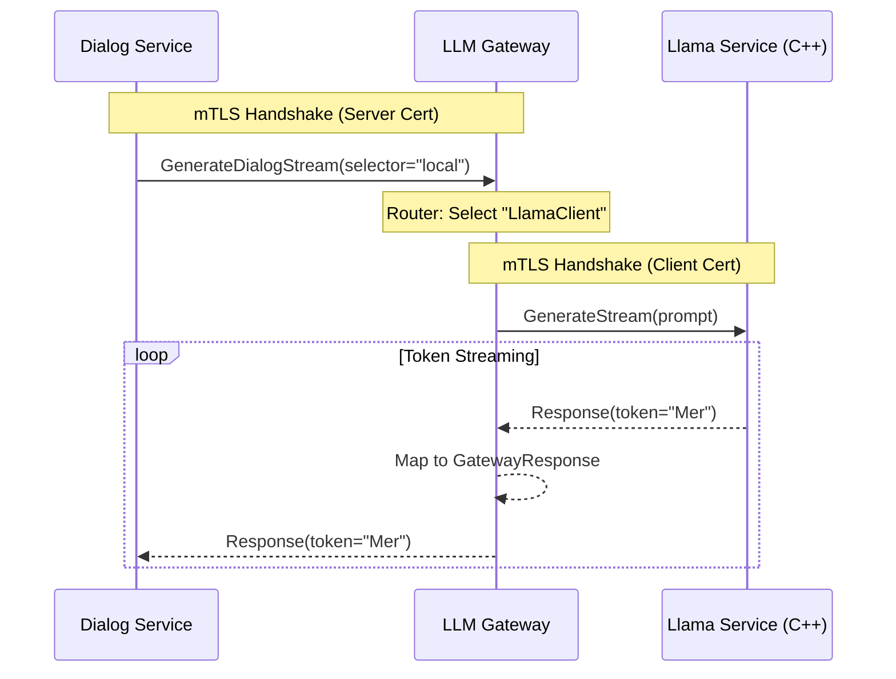

# 🧠 Mantık ve Yönlendirme Mimarisi (v2.0)

## 1. Yönlendirme Tablosu (Routing Logic)

Gateway, gRPC isteğindeki `model_selector` alanını analiz eder.

| Selector | Hedef Servis | Protokol | Güvenlik |
| :--- | :--- | :--- | :--- |
| `local` (veya boş veya llama) | **LLM Llama Service** | gRPC Stream | mTLS (Client Cert) |
| `cloud` | *Planlanıyor (Gemini)* | gRPC | mTLS |

## 2. Veri Akış Diyagramı

## 3. Güvenlik Mimarisi (mTLS)

Bu servis **Zero Trust** prensibiyle çalışır:
1.  **Server Modu:** Kendisine bağlanan `Dialog Service`'in güvenilir olduğunu doğrulamak için CA sertifikasını kullanır.
2.  **Client Modu:** `Llama Service`'e bağlanırken kendi kimliğini (Client Certificate) ibraz eder.

Sertifika yolları `config.rs` üzerinden yüklenir ve `src/tls.rs` modülünde işlenir.
