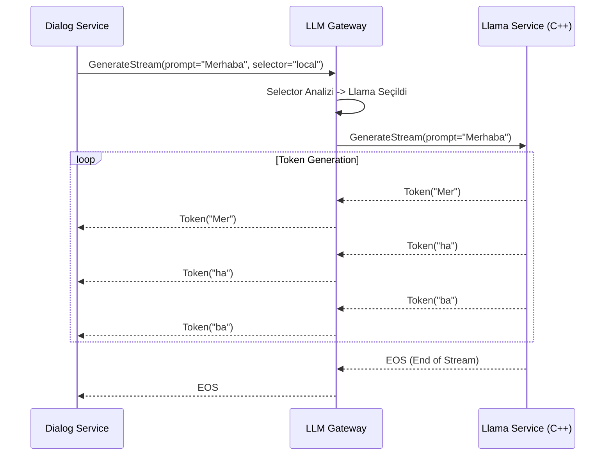

# 🧠 Mantık ve Yönlendirme Mimarisi

Bu belge, `llm-gateway-service`in model seçimini nasıl yaptığını ve token akışını nasıl yönettiğini açıklar.

## 1. Yönlendirme Tablosu (Routing Logic)

Gateway, gRPC isteğindeki `model_selector` alanını analiz eder (Format: `provider:model`).

| Ön Ek (Provider) | Hedef Servis | URL (Env Değişkeni) | Protokol |
| :--- | :--- | :--- | :--- |
| `local` (Varsayılan) | **LLM Llama Service** | `LLM_LLAMA_SERVICE_GRPC_URL` | gRPC Stream |
| `gemini` | **LLM Gemini Service** | `LLM_GEMINI_SERVICE_GRPC_URL` | gRPC Stream |
| `ollama` | **LLM Ollama Service** | `LLM_OLLAMA_SERVICE_URL` | REST/Stream |

*Örnek:* `model_selector: "local:gemma-2b"` -> `llm-llama-service`'e gider.

## 2. Akış Diyagramı (Token Streaming)

## 3. Fallback Stratejisi (Hata Yönetimi)

Eğer seçilen motor (örneğin Local Llama) `UNAVAILABLE` veya `DEADLINE_EXCEEDED` hatası verirse:

1.  **Logla:** Hatayı `WARN` seviyesinde logla.
2.  **Karar:** Konfigürasyonda `ENABLE_FALLBACK=true` ise:
    *   Otomatik olarak **Cloud Motoruna (Gemini)** yönlendir.
    *   İstemciye hissettirmeden akışı oradan başlat.
3.  **Aksi halde:** İstemciye hatayı dön.