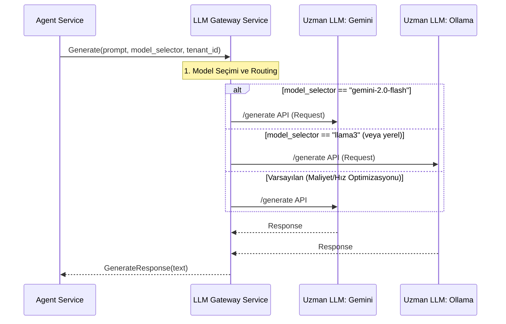

# 🧠 Sentiric LLM Gateway Service - Mantık ve Akış Mimarisi

**Stratejik Rol:** Agent Service'ten gelen genel amaçlı LLM isteklerini (Generate) alır, isteğin tipine, maliyet bütçesine ve istenen modele göre uygun uzman LLM motoruna (Gemini, Ollama vb.) yönlendirir.

---

## 1. Akıllı Yönlendirme ve Yük Dengeleme Akışı

LLM Gateway, tek bir LLM modeline bağımlılığı ortadan kaldırır ve dinamik olarak en uygun kaynağı seçer.

```mermaid
sequenceDiagram
    participant Agent as Agent Service
    participant LLMGateway as LLM Gateway Service
    participant Gemini as Uzman LLM: Gemini
    participant Ollama as Uzman LLM: Ollama
    
    Agent->>LLMGateway: Generate(prompt, model_selector, tenant_id)
    
    Note over LLMGateway: 1. Model Seçimi ve Routing
    alt model_selector == "gemini-2.0-flash"
        LLMGateway->>Gemini: /generate API (Request)
    else model_selector == "llama3" (veya yerel)
        LLMGateway->>Ollama: /generate API (Request)
    else Varsayılan (Maliyet/Hız Optimizasyonu)
        LLMGateway->>Gemini: /generate API
    end
    
    Gemini-->>LLMGateway: Response
    Ollama-->>LLMGateway: Response

    LLMGateway-->>Agent: GenerateResponse(text)
```

## 2. Temel Fonksiyonlar

* Caching (Gelecek): Tekrarlanan ve deterministik sorguların sonuçlarını Redis'te önbelleğe alacaktır.
* Fallback: Bir uzman motorun başarısız olması durumunda, isteği otomatik olarak başka bir motora yönlendirme yeteneği.
* Streaming Desteği: GenerateStream RPC'leri için WebSocket (veya SSE) arayüzlerini yönetecek iskeleti içerir.